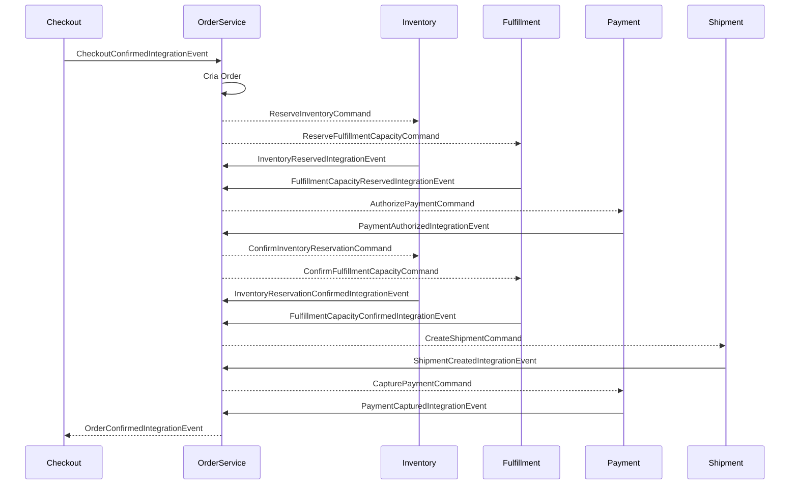

# OrderService

Microserviço responsável por criar, consultar, cancelar e orquestrar o ciclo de vida de pedidos comerciais. O serviço mantém o agregado `Order` como fonte de verdade local, executa uma Saga para coordenar estoque, fulfillment, pagamento e envio, e usa os padrões Inbox e Outbox transacional para idempotência e publicação confiável de mensagens.

## Índice

- [Visão geral](#visão-geral)
- [Responsabilidades do serviço](#responsabilidades-do-serviço)
- [Tecnologias e dependências](#tecnologias-e-dependências)
- [Arquitetura do projeto](#arquitetura-do-projeto)
- [Modelo de domínio](#modelo-de-domínio)
- [Fluxo principal da Saga](#fluxo-principal-da-saga)
- [Fluxos de falha e compensação](#fluxos-de-falha-e-compensação)
- [API HTTP](#api-http)
- [Contratos de integração](#contratos-de-integração)
- [Persistência](#persistência)
- [Inbox e Outbox](#inbox-e-outbox)
- [Configuração](#configuração)
- [Como executar localmente](#como-executar-localmente)
- [Observabilidade e saúde](#observabilidade-e-saúde)
- [Decisões e premissas importantes](#decisões-e-premissas-importantes)
- [Próximos passos recomendados](#próximos-passos-recomendados)

## Visão geral

O `OrderService` é um microserviço ASP.NET Core (.NET 8) que gerencia pedidos originados a partir de um checkout confirmado. Depois de receber o evento de checkout, o serviço:

1. Cria um pedido com os dados comerciais consolidados.
2. Solicita reserva de estoque.
3. Solicita reserva de capacidade de fulfillment.
4. Autoriza o pagamento quando ambas as reservas são concluídas.
5. Confirma as reservas após a autorização de pagamento.
6. Solicita a criação do envio.
7. Captura o pagamento após o envio ser criado.
8. Publica o evento de pedido confirmado.

A orquestração é feita por meio de transações locais e mensagens de integração gravadas no Outbox, reduzindo o risco de inconsistência entre a base de dados e o barramento de eventos.

## Responsabilidades do serviço

### Faz parte do escopo

- Persistir pedidos e seus itens.
- Controlar estados do pedido, reservas, pagamento e envio.
- Expor endpoint para consulta de pedido por `orderId`.
- Expor endpoint de cancelamento idempotente via header `Idempotency-Key`.
- Processar eventos de integração relacionados ao ciclo de vida do pedido.
- Produzir comandos para serviços externos de estoque, fulfillment, pagamento e envio.
- Publicar eventos de domínio/integração de pedido confirmado ou cancelado.
- Garantir idempotência de mensagens recebidas com Inbox.
- Garantir publicação confiável de mensagens com Outbox.

### Fora do escopo

- Reservar estoque de fato.
- Reservar capacidade de fulfillment de fato.
- Autorizar, capturar, estornar ou voidar pagamento de fato.
- Criar remessa/envio de fato.
- Implementar broker Kafka real; a implementação atual registra publicações em log.
- Expor endpoints administrativos para reprocessamento de Outbox ou Inbox.

## Tecnologias e dependências

- **.NET 8 / ASP.NET Core Minimal APIs** para a API HTTP.
- **Entity Framework Core 8** para acesso a dados.
- **Npgsql.EntityFrameworkCore.PostgreSQL** para PostgreSQL.
- **PostgreSQL** como banco relacional.
- **Swashbuckle.AspNetCore** para Swagger/OpenAPI em ambiente de desenvolvimento.
- **Health Checks** do ASP.NET Core com verificação do `DbContext`.
- **BackgroundService** para despacho periódico do Outbox.

## Arquitetura do projeto

```text
OrderService/
├── Api/
│   └── OrderEndpoints.cs              # Endpoints HTTP do recurso Orders
├── Application/
│   ├── OrderCancellationService.cs     # Cancelamento idempotente de pedidos
│   ├── OrderProcessManager.cs          # Orquestrador da Saga de pedidos
│   └── Ports/                          # Portas da aplicação
├── Contracts/
│   ├── IntegrationCommands.cs          # Comandos publicados para outros serviços
│   ├── IntegrationEvents.cs            # Eventos consumidos/publicados
│   └── OrderResponses.cs               # DTOs da API HTTP
├── Domain/
│   ├── Order.cs                        # Agregado principal
│   ├── OrderItem.cs                    # Item do pedido
│   ├── OrderStatus.cs                  # Status macro do pedido
│   └── ProcessStates.cs                # Estados de reserva, pagamento e envio
├── Infrastructure/
│   ├── Messaging/                      # Abstração e implementação do barramento
│   ├── Outbox/                         # Escrita e despacho do Outbox
│   └── Persistence/                    # DbContext, repositório e schema SQL
├── Program.cs                          # Configuração da aplicação
├── appsettings.json                    # Configuração padrão
└── OrderService.csproj                 # Projeto .NET
```

A separação segue uma variação de arquitetura em camadas/hexagonal:

- **Domain**: regras de negócio e transições válidas do agregado.
- **Application**: casos de uso, orquestração da Saga e idempotência.
- **Contracts**: mensagens e DTOs compartilhados.
- **Infrastructure**: banco de dados, Outbox e barramento.
- **Api**: superfície HTTP.

## Modelo de domínio

### Agregado `Order`

O pedido guarda dados comerciais do checkout e o estado operacional do fluxo:

- Identificadores: `Id`, `CheckoutId`, `BuyerId`, `SellerId`.
- Valores: `Currency`, `ItemsTotal`, `ShippingPrice`, `TotalAmount`.
- Dados logísticos/comerciais: `ShippingPromiseId`, `PricingQuoteId`.
- Referências externas: `InventoryReservationId`, `CapacityReservationId`, `PaymentAuthorizationId`, `ShipmentId`.
- Estados internos: `Status`, `InventoryState`, `CapacityState`, `PaymentState`, `ShipmentState`.
- Auditoria: `Version`, `CreatedAt`, `UpdatedAt`, `ConfirmedAt`, `CancelledAt`.
- Itens do pedido: lista de `OrderItem`.

### Validações principais

Ao criar um pedido, o domínio valida:

- `CheckoutId`, `BuyerId`, `SellerId` e `PricingQuoteId` obrigatórios.
- `Currency` e `ShippingPromiseId` obrigatórios.
- Frete não negativo.
- Ao menos um item.
- Cada item precisa ter `SkuId`, título, quantidade positiva e preço unitário não negativo.

### Status do pedido

| Status | Significado |
| --- | --- |
| `ReservingResources` | Pedido criado e aguardando reserva de estoque/capacidade. |
| `AwaitingPaymentAuthorization` | Reservas concluídas; aguardando autorização do pagamento. |
| `ConfirmingResources` | Pagamento autorizado; confirmando reservas. |
| `CreatingShipment` | Reservas confirmadas; criando envio. |
| `AwaitingPaymentCapture` | Envio criado; aguardando captura do pagamento. |
| `Confirmed` | Pagamento capturado; pedido confirmado. |
| `Cancelled` | Pedido cancelado antes do ponto de confirmação. |
| `PaymentReview` | Falha na captura de pagamento; requer tratativa manual/operacional. |
| `Failed` | Estado terminal reservado no domínio, sem uso direto no fluxo atual. |

### Estados auxiliares

#### Reserva (`ReservationState`)

- `NotRequested`
- `Requested`
- `Reserved`
- `Confirmed`
- `Failed`
- `Released`

#### Pagamento (`PaymentState`)

- `NotRequested`
- `AuthorizationRequested`
- `Authorized`
- `CaptureRequested`
- `Captured`
- `Failed`
- `Voided`

#### Envio (`ShipmentState`)

- `NotRequested`
- `Requested`
- `Created`
- `Failed`
- `Cancelled`

## Fluxo principal da Saga



### Detalhamento por etapa

1. **Checkout confirmado**
   - Entrada: `CheckoutConfirmedIntegrationEvent`.
   - Ação: cria o agregado `Order` se ainda não existir pedido para o mesmo `CheckoutId`.
   - Saídas:
     - `ReserveInventoryCommand` no tópico `inventory.commands`.
     - `ReserveFulfillmentCapacityCommand` no tópico `fulfillment.commands`.

2. **Reservas concluídas**
   - Entradas:
     - `InventoryReservedIntegrationEvent`.
     - `FulfillmentCapacityReservedIntegrationEvent`.
   - Ação: grava os identificadores das reservas.
   - Saída: quando as duas reservas estão concluídas, publica `AuthorizePaymentCommand` no tópico `payment.commands`.

3. **Pagamento autorizado**
   - Entrada: `PaymentAuthorizedIntegrationEvent`.
   - Ação: registra `PaymentAuthorizationId` e muda o pedido para confirmação de recursos.
   - Saídas:
     - `ConfirmInventoryReservationCommand` no tópico `inventory.commands`.
     - `ConfirmFulfillmentCapacityCommand` no tópico `fulfillment.commands`.

4. **Reservas confirmadas**
   - Entradas:
     - `InventoryReservationConfirmedIntegrationEvent`.
     - `FulfillmentCapacityConfirmedIntegrationEvent`.
   - Ação: marca confirmações no pedido.
   - Saída: quando as duas confirmações chegam, publica `CreateShipmentCommand` no tópico `shipment.commands`.

5. **Envio criado**
   - Entrada: `ShipmentCreatedIntegrationEvent`.
   - Ação: registra `ShipmentId`.
   - Saída: publica `CapturePaymentCommand` no tópico `payment.commands`.

6. **Pagamento capturado**
   - Entrada: `PaymentCapturedIntegrationEvent`.
   - Ação: marca o pedido como `Confirmed`.
   - Saída: publica `OrderConfirmedIntegrationEvent` no tópico `order.events`.

## Fluxos de falha e compensação

A Saga usa compensações antes do ponto crítico de captura do pagamento.

### Falha na reserva de estoque

- Entrada: `InventoryReservationFailedIntegrationEvent`.
- Efeito: pedido é cancelado com motivo de falha de reserva de estoque.
- Compensações possíveis:
  - Liberação de reserva de capacidade, se já existir.
  - Void de autorização de pagamento, se já existir.
- Saída: `OrderCancelledIntegrationEvent`.

### Falha na reserva de capacidade

- Entrada: `FulfillmentCapacityReservationFailedIntegrationEvent`.
- Efeito: pedido é cancelado com motivo de falha de capacidade de fulfillment.
- Compensações possíveis:
  - Liberação de reserva de estoque, se já existir.
  - Void de autorização de pagamento, se já existir.
- Saída: `OrderCancelledIntegrationEvent`.

### Falha na autorização de pagamento

- Entrada: `PaymentAuthorizationFailedIntegrationEvent`.
- Efeito: pedido é cancelado.
- Compensações:
  - Liberação de reserva de estoque.
  - Liberação de capacidade de fulfillment.
- Saída: `OrderCancelledIntegrationEvent`.

### Falha na criação de envio

- Entrada: `ShipmentCreationFailedIntegrationEvent`.
- Efeito: pedido é cancelado.
- Compensações:
  - Liberação de reserva de estoque.
  - Liberação de capacidade de fulfillment.
  - Void da autorização de pagamento.
- Saída: `OrderCancelledIntegrationEvent`.

### Falha na captura de pagamento

- Entrada: `PaymentCaptureFailedIntegrationEvent`.
- Efeito: pedido muda para `PaymentReview`.
- Observação: depois que o envio foi criado e a captura falhou, o serviço não cancela automaticamente. O estado `PaymentReview` indica necessidade de ação operacional para decidir retry, cobrança alternativa, cancelamento logístico, devolução ou conciliação.

### Cancelamento manual via API

O endpoint `POST /orders/{orderId}/cancel` cancela um pedido não confirmado, grava o comando no Inbox usando um identificador determinístico baseado em `orderId` e `Idempotency-Key`, e publica compensações conforme os recursos já alocados.

Pedidos confirmados não podem ser cancelados por esse fluxo; o domínio exige um processo específico de devolução ou reembolso.

## API HTTP

### Health check

```http
GET /health
```

Retorna o status de saúde da aplicação e do `OrderDbContext`.

### Consultar pedido

```http
GET /orders/{orderId}
```

#### Parâmetros

| Nome | Local | Tipo | Obrigatório | Descrição |
| --- | --- | --- | --- | --- |
| `orderId` | path | `uuid` | Sim | Identificador do pedido. |

#### Respostas

| Status | Descrição |
| --- | --- |
| `200 OK` | Pedido encontrado. |
| `404 Not Found` | Pedido não encontrado. |

#### Exemplo de resposta `200 OK`

```json
{
  "id": "6db17916-79f5-4d5e-a58f-c3b64f6ed019",
  "checkoutId": "7b33f3cf-93a5-4370-b74f-c782f4d1f2ac",
  "buyerId": "c0dc85d3-1fc6-4a18-af61-b0d25ff0126f",
  "sellerId": "67bc214c-456d-4d4f-8cbb-512c4fa5218a",
  "status": "Confirmed",
  "currency": "BRL",
  "itemsTotal": 150.00,
  "shippingPrice": 20.00,
  "totalAmount": 170.00,
  "shippingPromiseId": "SP-2026-0001",
  "pricingQuoteId": "29509c25-f14a-4024-a7ec-9677e17fd8b0",
  "inventoryReservationId": "2be3481c-5f19-4685-9f6e-0b7ea64657e1",
  "capacityReservationId": "e5ee8314-d0ec-4a7a-a23a-84013dfbd289",
  "paymentAuthorizationId": "87921a9f-aa74-4f56-903e-8241f4fa7262",
  "shipmentId": "b8a94b2c-0148-4f91-b179-1d4ee716eb7f",
  "createdAt": "2026-06-10T12:00:00Z",
  "updatedAt": "2026-06-10T12:10:00Z",
  "confirmedAt": "2026-06-10T12:10:00Z",
  "cancelledAt": null,
  "items": [
    {
      "skuId": "6d2bd6a9-d6bb-4c61-815f-7d5a6e256f3a",
      "title": "Produto exemplo",
      "quantity": 2,
      "unitPrice": 75.00,
      "totalPrice": 150.00
    }
  ]
}
```

### Cancelar pedido

```http
POST /orders/{orderId}/cancel
Idempotency-Key: cancelamento-123
Content-Type: application/json

{
  "reason": "Solicitação do comprador"
}
```

#### Parâmetros e headers

| Nome | Local | Tipo | Obrigatório | Descrição |
| --- | --- | --- | --- | --- |
| `orderId` | path | `uuid` | Sim | Identificador do pedido. |
| `Idempotency-Key` | header | `string` | Sim | Chave idempotente para evitar cancelamentos duplicados. |
| `reason` | body | `string` | Sim | Motivo do cancelamento. |

#### Respostas

| Status | Descrição |
| --- | --- |
| `202 Accepted` | Solicitação aceita e processada de forma idempotente. |
| `400 Bad Request` | Header `Idempotency-Key` ausente ou vazio. |
| `404 Not Found`/erro tratado | Pedido não encontrado, dependendo da configuração de tratamento global de exceções. |
| `500 Internal Server Error`/erro tratado | Erro inesperado durante processamento. |

> Observação: o código atual lança `KeyNotFoundException` quando o pedido não existe. O middleware de exceções está registrado, mas não há mapeamento explícito no endpoint para transformar esse caso em `404`.

## Contratos de integração

### Eventos consumidos

| Evento | Origem esperada | Finalidade |
| --- | --- | --- |
| `CheckoutConfirmedIntegrationEvent` | Checkout | Inicia criação e orquestração do pedido. |
| `InventoryReservedIntegrationEvent` | Inventory | Informa que o estoque foi reservado. |
| `InventoryReservationFailedIntegrationEvent` | Inventory | Informa falha na reserva de estoque. |
| `FulfillmentCapacityReservedIntegrationEvent` | Fulfillment | Informa que a capacidade foi reservada. |
| `FulfillmentCapacityReservationFailedIntegrationEvent` | Fulfillment | Informa falha na reserva de capacidade. |
| `PaymentAuthorizedIntegrationEvent` | Payment | Informa autorização de pagamento. |
| `PaymentAuthorizationFailedIntegrationEvent` | Payment | Informa falha na autorização. |
| `InventoryReservationConfirmedIntegrationEvent` | Inventory | Informa confirmação definitiva da reserva de estoque. |
| `FulfillmentCapacityConfirmedIntegrationEvent` | Fulfillment | Informa confirmação definitiva da reserva de capacidade. |
| `ShipmentCreatedIntegrationEvent` | Shipment | Informa criação de envio. |
| `ShipmentCreationFailedIntegrationEvent` | Shipment | Informa falha ao criar envio. |
| `PaymentCapturedIntegrationEvent` | Payment | Informa captura de pagamento. |
| `PaymentCaptureFailedIntegrationEvent` | Payment | Informa falha na captura. |

### Eventos publicados

| Evento | Tópico | Quando é publicado |
| --- | --- | --- |
| `OrderConfirmedIntegrationEvent` | `order.events` | Após captura de pagamento bem-sucedida. |
| `OrderCancelledIntegrationEvent` | `order.events` | Após cancelamento manual ou falha compensável da Saga. |

### Comandos publicados

| Comando | Tópico | Finalidade |
| --- | --- | --- |
| `ReserveInventoryCommand` | `inventory.commands` | Solicitar reserva de estoque. |
| `ReserveFulfillmentCapacityCommand` | `fulfillment.commands` | Solicitar reserva de capacidade logística. |
| `AuthorizePaymentCommand` | `payment.commands` | Solicitar autorização do pagamento. |
| `ConfirmInventoryReservationCommand` | `inventory.commands` | Confirmar reserva de estoque após pagamento autorizado. |
| `ConfirmFulfillmentCapacityCommand` | `fulfillment.commands` | Confirmar reserva de capacidade após pagamento autorizado. |
| `CreateShipmentCommand` | `shipment.commands` | Solicitar criação do envio. |
| `CapturePaymentCommand` | `payment.commands` | Capturar pagamento após envio criado. |
| `ReleaseInventoryReservationCommand` | `inventory.commands` | Liberar reserva de estoque em compensação. |
| `ReleaseFulfillmentCapacityCommand` | `fulfillment.commands` | Liberar capacidade de fulfillment em compensação. |
| `VoidPaymentAuthorizationCommand` | `payment.commands` | Voidar autorização de pagamento em compensação. |

## Persistência

O banco de dados é PostgreSQL. O schema SQL de referência está em `Infrastructure/Persistence/schema.sql`.

### Tabelas

#### `orders`

Armazena o agregado principal do pedido. Campos relevantes:

- `id`: chave primária.
- `checkout_id`: identificador do checkout; possui restrição `UNIQUE` para evitar pedido duplicado por checkout.
- `buyer_id`, `seller_id`: participantes comerciais.
- `status`: status macro do pedido.
- `currency`, `items_total`, `shipping_price`, `total_amount`: dados monetários.
- `shipping_promise_id`, `pricing_quote_id`: referências comerciais/logísticas.
- `inventory_reservation_id`, `capacity_reservation_id`, `payment_authorization_id`, `shipment_id`: referências para serviços externos.
- `inventory_state`, `capacity_state`, `payment_state`, `shipment_state`: estados auxiliares da Saga.
- `cancellation_reason`: motivo do cancelamento.
- `version`: versão incremental alterada a cada mudança no agregado.
- `created_at`, `updated_at`, `confirmed_at`, `cancelled_at`: auditoria temporal.

Índices:

- `idx_orders_buyer_created` para consultas por comprador e data.
- `idx_orders_seller_created` para consultas por vendedor e data.
- `idx_orders_status_updated` para consultas operacionais por status.

#### `order_items`

Armazena os itens do pedido:

- `id`: chave primária.
- `order_id`: FK para `orders`.
- `sku_id`: SKU/produto.
- `title`: título congelado no momento da compra.
- `quantity`: quantidade.
- `unit_price`: preço unitário congelado.

#### `inbox_messages`

Armazena mensagens/comandos já processados para garantir idempotência:

- `message_id`: chave primária.
- `message_type`: tipo da mensagem.
- `processed_at`: data/hora de processamento.

#### `outbox_messages`

Armazena mensagens pendentes de publicação:

- `id`: chave primária.
- `topic`: tópico de destino.
- `message_type`: tipo da mensagem.
- `aggregate_key`: chave de ordenação/particionamento.
- `payload`: JSON da mensagem.
- `created_at`: data/hora de criação.
- `processed_at`: preenchido após publicação bem-sucedida.
- `attempts`: tentativas de publicação.
- `next_attempt_at`: próxima tentativa após falha.
- `last_error`: último erro de publicação.

Índice:

- `idx_outbox_pending` para buscar mensagens pendentes ordenadas por disponibilidade e criação.

## Inbox e Outbox

### Inbox

O `OrderProcessManager` usa o método `ExecuteOnceAsync` para:

1. Verificar se `MessageId` já existe em `inbox_messages`.
2. Abrir transação.
3. Executar a transição de estado e gravação de mensagens no Outbox.
4. Registrar a mensagem recebida no Inbox.
5. Salvar alterações e commitar a transação.

Esse mecanismo evita reprocessamento quando um evento é entregue mais de uma vez pelo broker.

No cancelamento HTTP, o serviço cria um `MessageId` determinístico a partir de `orderId` e `Idempotency-Key`, permitindo repetir a mesma requisição sem duplicar compensações.

### Outbox

A escrita no Outbox ocorre dentro da mesma transação que altera o pedido. O `OutboxDispatcher` executa a cada 1 segundo e:

1. Busca até 100 mensagens pendentes.
2. Publica cada mensagem via `IIntegrationEventBus`.
3. Marca a mensagem como processada em caso de sucesso.
4. Em caso de falha, incrementa tentativas, registra erro e agenda uma próxima tentativa.

A implementação atual de `KafkaIntegrationEventBus` apenas escreve as mensagens em log. Para produção, essa classe deve ser substituída por uma implementação real usando Kafka, RabbitMQ, Azure Service Bus ou outro broker adotado pela plataforma.

## Configuração

### `appsettings.json`

```json
{
  "ConnectionStrings": {
    "OrderDb": "Host=localhost;Database=orderservice;Username=postgres;Password=postgres"
  },
  "Logging": {
    "LogLevel": {
      "Default": "Information",
      "Microsoft.AspNetCore": "Warning"
    }
  },
  "AllowedHosts": "*"
}
```

### Variáveis de ambiente úteis

| Variável | Exemplo | Descrição |
| --- | --- | --- |
| `ASPNETCORE_ENVIRONMENT` | `Development` | Habilita Swagger e configurações de desenvolvimento. |
| `ConnectionStrings__OrderDb` | `Host=localhost;Database=orderservice;Username=postgres;Password=postgres` | Sobrescreve a conexão com PostgreSQL. |
| `ASPNETCORE_URLS` | `http://localhost:5279` | Define a URL de escuta da aplicação. |

## Como executar localmente

### Pré-requisitos

- .NET SDK 8 instalado.
- PostgreSQL disponível localmente ou via container.
- Banco `orderservice` criado.

### 1. Subir PostgreSQL com Docker

```bash
docker run --name orderservice-postgres \
  -e POSTGRES_DB=orderservice \
  -e POSTGRES_USER=postgres \
  -e POSTGRES_PASSWORD=postgres \
  -p 5432:5432 \
  -d postgres:16
```

### 2. Criar o schema

```bash
psql "Host=localhost;Database=orderservice;Username=postgres;Password=postgres" \
  -f Infrastructure/Persistence/schema.sql
```

Alternativamente, use qualquer cliente PostgreSQL para executar o conteúdo de `Infrastructure/Persistence/schema.sql`.

### 3. Restaurar dependências

```bash
dotnet restore
```

### 4. Compilar

```bash
dotnet build
```

### 5. Executar

```bash
dotnet run
```

Com `ASPNETCORE_ENVIRONMENT=Development`, a documentação Swagger fica disponível em:

```text
/swagger
```

E o health check em:

```text
/health
```

## Observabilidade e saúde

- O endpoint `/health` valida o estado geral da aplicação e a conectividade do `OrderDbContext`.
- O `OutboxDispatcher` registra erro quando um ciclo de despacho falha.
- O barramento atual registra em log cada mensagem publicada, com tipo, tópico, chave e payload.
- Falhas de publicação no Outbox ficam registradas em `last_error`, com incremento de `attempts` e agendamento em `next_attempt_at`.

## Decisões e premissas importantes

- **Pedido único por checkout**: a coluna `checkout_id` é única e o processador verifica duplicidade antes de criar pedido.
- **Saga orquestrada**: o `OrderService` decide a próxima etapa e publica comandos para outros serviços.
- **Ponto de atenção na captura**: após `ShipmentCreatedIntegrationEvent`, o serviço solicita captura. Se a captura falhar, o pedido vai para `PaymentReview`, não para cancelamento automático.
- **Idempotência por mensagem**: eventos de integração dependem de `MessageId` único.
- **Idempotência no cancelamento HTTP**: depende do header `Idempotency-Key`.
- **Publicação assíncrona**: as mensagens são persistidas no Outbox e publicadas posteriormente pelo dispatcher.
- **Implementação de broker simulada**: o barramento atual não envia mensagens para Kafka real; apenas loga a publicação.
- **Swagger apenas em desenvolvimento**: a UI do Swagger é habilitada quando o ambiente é `Development`.

## Próximos passos recomendados

- Implementar consumidores reais para eventos de integração e conectá-los ao `OrderProcessManager`.
- Substituir `KafkaIntegrationEventBus` por uma implementação real de Kafka ou broker padrão da organização.
- Adicionar migrations do EF Core ou pipeline automatizado de aplicação do schema.
- Adicionar testes unitários para transições do agregado `Order`.
- Adicionar testes de integração para Inbox, Outbox e endpoints HTTP.
- Mapear exceções de aplicação para respostas HTTP padronizadas, especialmente `KeyNotFoundException` para `404 Not Found`.
- Adicionar observabilidade com tracing distribuído, métricas de Outbox e dashboards de pedidos por status.
- Implementar estratégia operacional para pedidos em `PaymentReview`.
